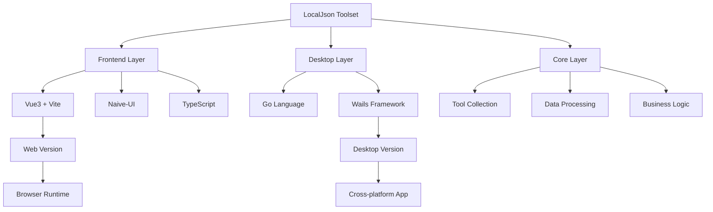
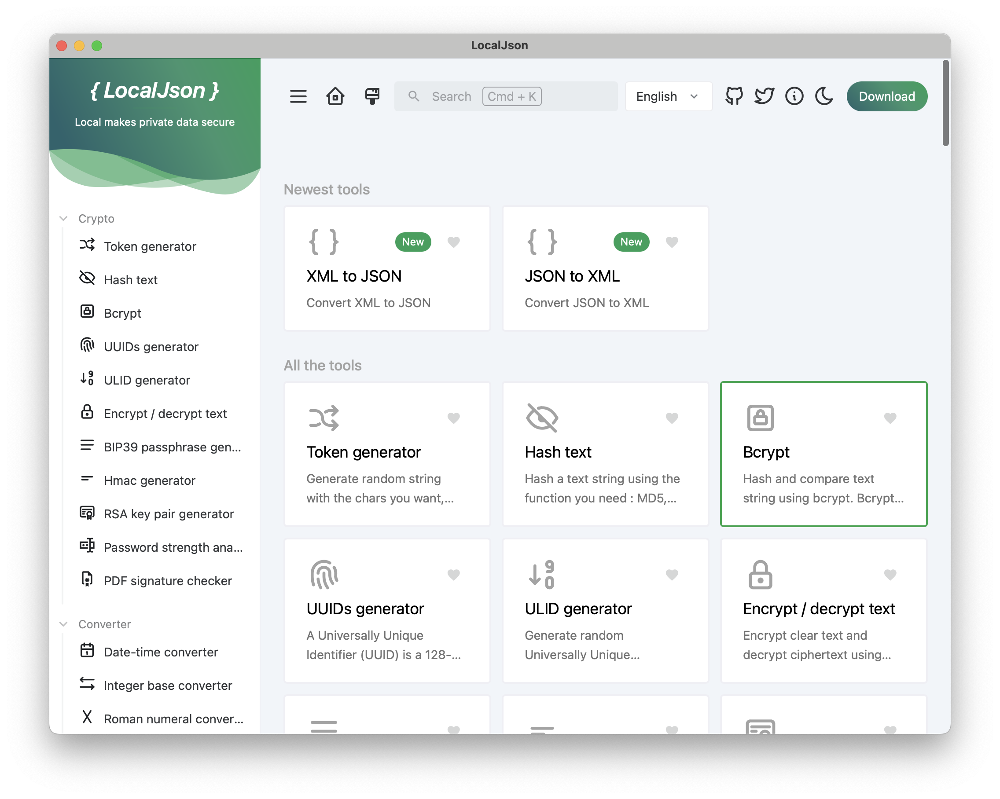

# LocalJson Toolset

> ⚠️ **Major Update Warning**: LocalJson has completed Monorepo migration. Project structure and build process have significant changes, please read the documentation carefully.

[English](README.md) | [中文](README_zh.md)

A lightweight cross-platform toolset based on Wails, supporting both web and desktop platforms including Mac, Windows, and Linux.

## About

This project is a frontend implementation of [It-Tools](https://github.com/CorentinTh/it-tools) using [Vue3](https://github.com/vuejs/vue), [Vite](https://github.com/vitejs/vite), [Naive-UI](https://github.com/tusen-ai/naive-ui), and TypeScript. The desktop version is implemented using [Wails](https://github.com/wailsapp/wails) with Go. Special thanks to other open-source projects.

## Architecture


```mermaid
graph TD
    A[LocalJson Toolset] --> B[Frontend Layer]
    A --> C[Desktop Layer]
    A --> D[Core Layer]
    
    B --> B1[Vue3 + Vite]
    B --> B2[Naive-UI]
    B --> B3[TypeScript]
    
    C --> C1[Go Language]
    C --> C2[Wails Framework]
    
    D --> D1[Tool Collection]
    D --> D2[Data Processing]
    D --> D3[Business Logic]
    
    B1 --> E[Web Version]
    C2 --> F[Desktop Version]
    
    E --> G[Browser Runtime]
    F --> H[Cross-platform App]
```

### Project Structure

```bash
localjson/
├── app/
│   ├── services/
│   ├── storage/
├── packages/
│   ├── core/
│   │   ├── src/
│   │   └── package.json
│   ├── desktop/
│   └── web/
├── main.go
├── go.mod
└── wails.json
```

## Screenshot



## Building

### Requirements

* Go（latest version）
* Node.js >= 18
* NPM >= 9

### Install Dependencies

```bash
git clone https://github.com/inRemark/localjson.git
go install github.com/wailsapp/wails/v2/cmd/wails@latest
pnpm install
```

### Run

```bash
# web
pnpm web:dev
# desktop
pnpm wails:dev
```

## License

This project is under the [GNU GPLv3](LICENSE).
