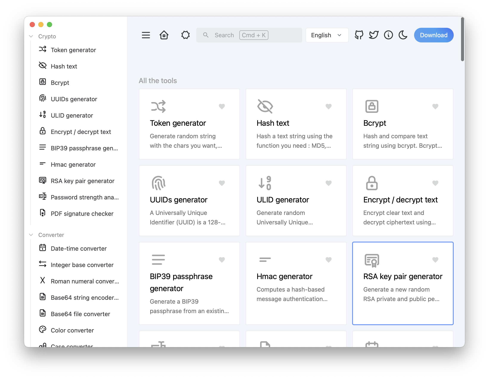

# LocalJson Toolset

[English](README.md) | [中文](README_zh.md)

## A lightweight cross-platform toolset based on Wails, supporting both web and desktop platforms including Mac, Windows, and Linux.

## About

This project is a frontend implementation of [It-Tools](https://github.com/CorentinTh/it-tools) using [Vue3](https://github.com/vuejs/vue), 
[Vite](https://github.com/vitejs/vite), [Naive-UI](https://github.com/tusen-ai/naive-ui), 
and TypeScript. The desktop version is implemented using [Wails](https://github.com/wailsapp/wails) with Go. 
Special thanks to other open-source projects.



## Building

### Requirements

* Go（latest version）
* Node.js >= 18
* NPM >= 9

### Install Wails

```bash
go install github.com/wailsapp/wails/v2/cmd/wails@latest
```

### Clone the Repository

```bash
git clone https://github.com/inRemark/localjson.git
```

### Build Frontend Code

```bash
pnpm install --prefix ./frontend

# or

cd frontend
pnpm install
```

### Run

```bash
wails dev
```

## License

This project is under the [GNU GPLv3](LICENSE).

