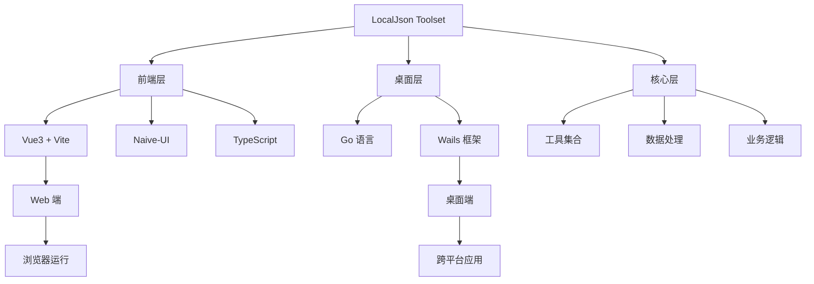

# LocalJson Toolset

> ⚠️ **重大更新警示**: LocalJson 已完成 Monorepo 迁移，项目结构和构建方式有重大变化，请仔细阅读文档。

[English](README.md) | [中文](README_zh.md)

一个基于Wails实现的轻量化跨平台工具集，支持Web端和Mac、Windows和Linux等桌面端

## 关于

该项目前端基于[Vue3](https://github.com/vuejs/vue)、[Vite](https://github.com/vitejs/vite)、[Naive-UI](https://github.com/tusen-ai/naive-ui)和TypeScript实现的[It-Tools](https://github.com/CorentinTh/it-tools)，
桌面端基于Go实现的[Wails](https://github.com/wailsapp/wails), 同时感谢其他开源项目。

## 系统架构



### 项目结构

```bash
localjson/
├── app/
│   ├── services/
│   ├── storage/
├── packages/
│   ├── core/
│   │   ├── src/
│   │   └── package.json
│   ├── desktop/
│   └── web/
├── main.go
├── go.mod
└── wails.json
```

## 桌面截图


## 构建

### 运行环境要求

* Go（最新版本）
* Node.js >= 18
* NPM >= 9

### 安装依赖

```bash
git clone https://github.com/inRemark/localjson.git
go install github.com/wailsapp/wails/v2/cmd/wails@latest
pnpm install
```

### 运行

```bash
# web
pnpm web:dev
# desktop
pnpm wails:dev
```

## License

This project is under the [GNU GPLv3](LICENSE).
